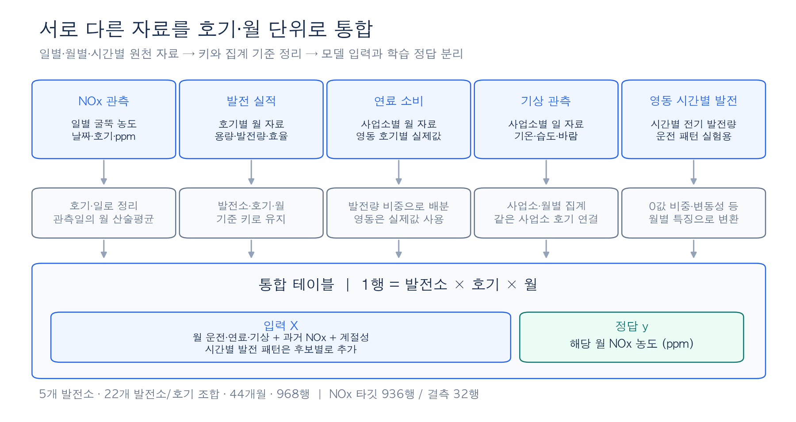
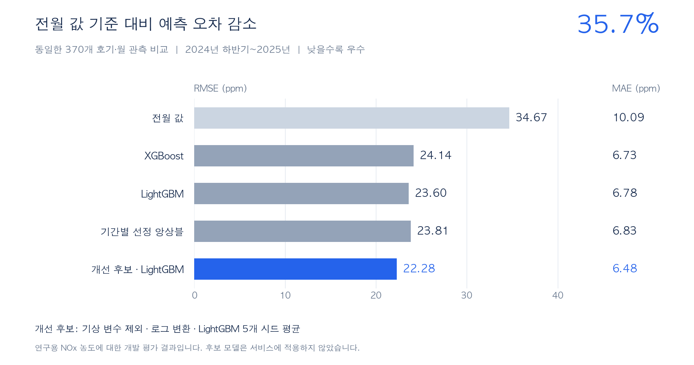
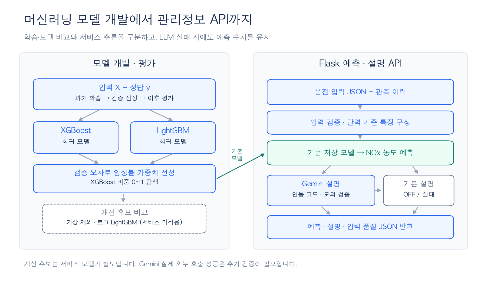

# 발전소 NOx 예측 및 LLM 기반 대기오염 관리 시스템

실제 발전소의 배출·운전 데이터를 통합해 **월별 NOx 농도(ppm)를 예측**하고, 예측 결과를 이해할 수 있는 관리정보로 연결한 프로젝트입니다. 데이터 전처리부터 머신러닝 모델 비교, Flask API와 Gemini 연동까지 구현했습니다.

**기간** 2025.06–07 공모전 · 2026.09–10 고도화\
**담당** 데이터 통합·특징 설계 · 모델 개발·평가 · 백엔드·LLM 연동\
**기술** Python · Pandas · Scikit-learn · XGBoost · LightGBM · Flask · Gemini

## 사용 데이터

**분당·삼천포·여수·영동·영흥 5개 발전소**의 2023년 1월~2026년 8월 자료입니다. **22개 발전소·호기 조합 × 44개월 = 968행**으로 통합했습니다.

| 구성 | 내용 | 역할 |
| --- | --- | --- |
| 식별키 | 발전소 · 호기 · 월 | 1행은 한 호기의 한 달 |
| 입력 X | 발전 실적·연료·기상 + 과거 NOx·운전 패턴·계절성 | 후보별 변수 묶음을 비교 |
| 정답 y | 해당 월 NOx 농도(ppm) | 관측 936행 · 결측 32행(학습·평가 제외) |

*월 총배출량 kg이 아닌 일별 농도의 월 산술평균을 연구 타깃으로 사용합니다. 영동 시간별 발전 자료 11,664개를 보완했으며, [변수·단위·결합 기준](docs/DATA_QUALITY.md#통합-테이블과-모델-입력)은 별도로 정리했습니다.*

## 예측 모델

- **특징 설계:** 전월 NOx, 직전 3개월 평균, 연료 소비 변화율, 발전량 대비 연료 소비, 월별 계절성을 구성했습니다.
- **모델 비교:** XGBoost·LightGBM 회귀 모델을 비교하고, 검증 오차가 가장 낮은 앙상블 가중치를 탐색했습니다.
- **시간 순서 검증:** 과거로 학습하고 이후 기간을 평가하는 3개 구간으로 검증했습니다. 변수 묶음·로그 변환을 비교해 **기상 제외·로그 LightGBM**을 개선 후보로 선정했습니다.

## 주요 성과

**전월 값 예측 대비 RMSE 35.7% 감소 — 34.67 → 22.28 ppm**

*2024년 하반기~2025년의 동일한 기존 호기·월 370건에서 비교한 개발 결과입니다. 평가 기간을 반복 활용했으며, 급등 구간의 오차가 남아 후보의 서비스 적용은 보류했습니다.*

## 핵심 문제 해결과 서비스 연결

- **데이터 정합성:** 연료 ton·kL를 분리하고, 누락된 달을 고려해 전월·이동평균을 계산했습니다. 전처리 통계는 학습 구간에서만 산출했습니다.
- **API 서비스화:** Flask에서 운전정보 검증 → NOx 예측 → Gemini 설명 → 구조화 JSON 반환을 연결했습니다. 응답 오류 시 기본 설명을 반환해 예측값을 유지했습니다.
- **신뢰성 검증:** 로컬 자료를 포함한 **164개 테스트 통과**, 실제 HTTP 요청 정상 응답을 확인했습니다. Gemini는 모의 응답으로 검증했으며 실제 외부 호출 확인은 남아 있습니다.

[모델 평가](docs/EVALUATION.md) · [데이터 정의](docs/DATA_QUALITY.md) · [API 설계](docs/API_GEMINI.md) · [코드 및 개발 안내](NOx_corrected/README.md)
