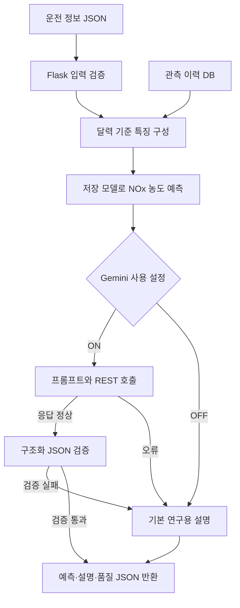
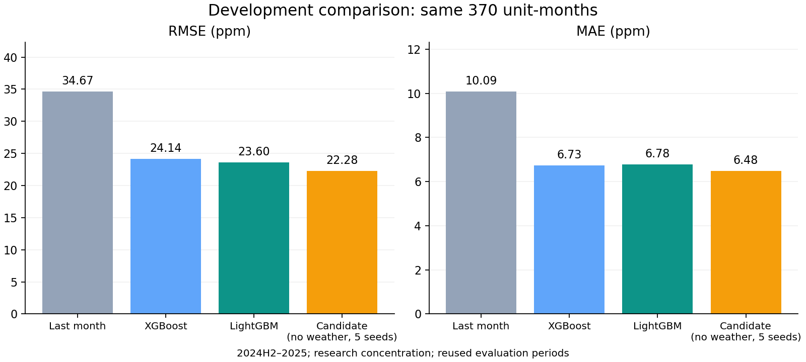

# 발전소 NOx 예측 및 LLM 기반 대기오염 관리 시스템

산업통상자원부 공모전 프로젝트와 이후 재현성·데이터 품질·서비스 연동 보완 작업을 정리한 저장소입니다. 발전소별 NOx 관측값, 발전 실적, 연료 및 기상 자료를 통합하고, XGBoost·LightGBM으로 월별 NOx **농도(ppm)**를 추정합니다. Flask API는 예측 수치와 입력 품질을 반환하며, Gemini 연동을 통해 연구용 설명을 추가할 수 있습니다.

> 현재 타깃은 관측된 일평균 농도를 월별로 산술평균한 **연구용 농도**입니다. 공식 월평균·월 총배출량(kg)과 구분합니다. 측정 유효성·기관 집계 정의는 확인 중이며, 개선 후보의 성능은 이미 검토한 기간에서 얻은 개발 결과입니다.

## 현재 구현 상태

| 항목 | 완료한 내용 | 남은 확인 |
| --- | --- | --- |
| 데이터 통합 | 분당·삼천포·여수·영동·영흥, 발전소·호기·월 기준 결합 | 일부 기상 결측, 원천 자료 공표 지연 |
| 데이터 품질 | 날짜·호기 대응, 중복·결측 검사, 급등 검토 사유 기록 | 급등 시 측정 유효 코드·산소 보정·유효 시간 |
| 특징 설계 | 전월 값, 직전 3개월 평균, 연료 변화·발전량 대비 연료, 계절성 | SCR 운전·환원제·연소 조건 자료 |
| 모델 평가 | 달력 월을 묶은 3개 시간 순서 검증, 기준 예측 비교, 변수·타깃 변환 실험 | 새 미사용 기간의 최종 평가 |
| 최신 이력 | 모델별 SQLite 관측 이력, 입수 시각·개정·중복 반입 관리 | 신규 관측 자료의 주기적 확보 |
| 운전 패턴 | 영동 시간별 발전량의 정지 비중·변동·전환 특징 | 발전량 0을 SCR 정지로 해석할 근거 없음 |
| Flask | `/api/health`, `/api/history/status`, `/api/predict` | 운영 배포는 별도 |
| Gemini | 프롬프트, REST 호출, JSON 검증, 실패 시 기본 설명 | 실제 외부 호출 성공 미검증; 기본값 OFF |
| 기관 확인 후 재학습 | 일평균 재현·규칙 버전·재학습 차단 조건 구현 | 기관 증빙·원시 구간 자료 확보 후 실행 |

## 시스템 흐름



수치 예측은 ML 모델이 생성하고, Gemini는 설명을 추가합니다. LLM 실패 시에도 예측값은 유지합니다. 입력 조건만으로 급등 원인·설비 상태·법적 기준 초과를 확정하지 않습니다.

## 성능: 같은 기간·같은 370개 호기·월 관측

평가 구간은 **2024년 하반기~2025년**, 학습 시 관측한 기존 호기 370개 행입니다. 신규 여수 2호기 12개 행은 별도 진단 대상으로 분리했습니다. RMSE는 큰 오차에 더 민감하고, MAE는 절대 오차의 평균입니다. 둘 다 작을수록 좋습니다.

| 예측 방법 | RMSE (ppm) | MAE (ppm) |
| --- | ---: | ---: |
| 전월 NOx 값 | 34.67 | 10.09 |
| 직전 3개월 평균 | 31.14 | 10.02 |
| 학습 호기 평균 | 25.67 | 8.96 |
| XGBoost | 24.14 | 6.73 |
| LightGBM | 23.60 | 6.78 |
| 기간별 선정 앙상블 | 23.81 | 6.83 |
| **개선 후보: 기상 제외·로그 LightGBM, 5개 시드 평균** | **22.28** | **6.48** |



후보의 RMSE는 전월 값 방식 대비 **35.7%**, 기존 LightGBM 대비 **5.6%** 감소했습니다. 여수 RMSE 악화와 영동·삼천포 급등의 과소 예측이 남아 있어 **서비스 모델은 교체하지 않았습니다**. 이 수치를 미사용 기간의 최종 성능이나 모든 발전소의 일률적 개선으로 해석하지 않습니다.

초기 보완 모델과 2025년 상반기까지 재학습한 모델을 **2026년 1~8월의 동일한 기존 호기 168개 행**에서 비교하면, RMSE는 **54.72 → 52.38 ppm(4.3% 감소)**, MAE는 **11.44 → 10.91 ppm(4.7% 감소)**입니다. 위 370개 행 결과와는 평가 기간·모델이 다릅니다. [지역별 수치와 비교 조건](docs/EVALUATION.md)을 참고하세요.

## 문제 상황과 해결

| 문제 | 구현한 해결 | 현재 한계 |
| --- | --- | --- |
| `NOX_kg`의 월 질량 환산 근거 불명확 | 원본과 진단용 legacy 모드를 보존하고 ppm 농도 타깃으로 분리 | kg 모델은 유량·표준 상태·시간 정의 확인 필요 |
| 결측 달이 있으면 단순 행 이동이 전월을 잘못 참조 | 달력 월로 전월·직전 3개월을 구성 | 월초 미래 예측에는 입력 가용성 추가 검증 필요 |
| 단위가 다른 연료를 합산하거나 호기 연료를 잘못 대응 | ton·kL 분리, 추정 배분과 영동 호기 실적을 명시적으로 구분 | 연료 API 전체 공식 코드표 확인 필요 |
| 특정 기간에서만 모델·가중치가 유리할 수 있음 | 기간 A/B/C 분리, 검증에서만 전처리·가중치 확정 | 반복 활용한 평가 기간은 개발 참고 자료 |
| 급등을 이상치로 삭제하면 실제 사건이 사라짐 | 검토 표시를 남기고 값 유지; 기관 확인·재현 절차 구현 | 유효 급등인지 집계 오류인지 아직 미확정 |
| 서버 이력이 오래되거나 모델과 다른 DB가 연결됨 | 이력 갱신·모델 식별·개정·입수 시각·충돌 검사 | 새 DB는 로컬에서 초기화 필요 |
| LLM 응답 형식 오류·외부 호출 실패 | 스키마·종료 상태·크기·시간 제한 검사와 기본 응답 | 실제 Gemini 성공 호출은 별도 확인 |

## 실행

Python **3.12.2** 및 [검증한 패키지 버전](NOx_corrected/requirements-verified.txt)을 사용했습니다. **공개 범위는 코드·문서·집계 성능표·그림·가상 입력 예시입니다.** 원천 데이터·학습 모델·행별 예측·개인 DB는 공개하지 않습니다. 예측 서버와 전체 통합 테스트에는 기존 로컬 자료·모델이 필요합니다.

```bash
git clone https://github.com/juuu-sung/IndustryAndCommerce.git
cd IndustryAndCommerce
# 기존 NOx_corrected가 저장소와 같은 상위 폴더에 있는 경우
python scripts/restore_local_assets.py --source ../NOx_corrected
cd NOx_corrected
python -m venv .venv
source .venv/bin/activate
python -m pip install -r requirements.txt
python -m nox.history init
python -m nox.app
```

다른 터미널에서:

```bash
cd IndustryAndCommerce/NOx_corrected
curl -sS http://127.0.0.1:5001/api/health
curl -sS http://127.0.0.1:5001/api/predict \
  -H 'Content-Type: application/json' \
  --data-binary @examples/request.json
```

기본 API는 **2023년까지 학습한 `artifacts/concentration`** 모델을 사용합니다. 기상 제외 개선 후보가 자동으로 연결되는 것은 아닙니다. 다른 저장 모델과 이력을 선택하는 방법은 [실행 안내](NOx_corrected/README.md)에 있습니다. macOS에서 LightGBM 로딩 시 `libomp` 오류가 발생하면 해당 환경의 OpenMP 런타임을 설치해야 합니다.

```bash
# NOx_corrected 안에서
python -m pytest -q
# 자료·모델을 연결한 뒤 전체 검증: 자료가 빠지면 실패로 알림
python -m pytest -q --require-local-assets
```

기존 로컬 자료·모델을 연결한 전체 검증에서 **164개 테스트가 모두 통과**했고, 실제 로컬 HTTP에서도 상태 확인·예측 요청 모두 200 응답을 확인했습니다. 공개 파일만 분리한 검사에서는 **71개 통과, 자료 의존 검사 93개 건너뜀**을 확인했습니다. `--require-local-assets`를 사용하면 자료 누락을 실패로 알립니다. [반영 검증 기록](docs/RELEASE_CHECK.md)에 범위와 한계를 남겼습니다.

## 문서와 코드

| 경로 | 내용 |
| --- | --- |
| [NOx_corrected](NOx_corrected/README.md) | 보완 코드·실행·재학습 명령 |
| [모델 평가](docs/EVALUATION.md) | 기간별 설계, 지역별 오차, 초기 모델 비교 |
| [데이터·품질](docs/DATA_QUALITY.md) | 타깃 정의, 단위·출처, 급등 검토, 부족한 자료 |
| [API·Gemini](docs/API_GEMINI.md) | 요청·응답, 환경 변수, 연동 검증 상태 |
| [기관 확인 및 다음 단계](docs/TARGET_VALIDATION.md) | 요청→일평균 재현→타깃 버전→재학습 |
| [진행 기록](docs/PROGRESS.md) | 공모전 원본과 이후 보완 작업 구분 |
| [원본 README 기록](docs/archive/competition_readme_2025.md) | 2025년 공모전 당시 설명; 현재 검증 상태와 구분 |
| [표·그림 생성 코드](scripts/summarize_results.py) | 저장 예측의 동일 관측 대조 및 지표 재계산 |

원래 발전 실적 수집 노트북은 저장소 최상위에 그대로 보존했습니다. 이후 보완 코드는 `NOx_corrected/`에 추가했습니다. 원천 자료·모델·개인 키·실행 이력 DB·기관 비공개 자료는 Git에서 제외합니다. `restore_local_assets.py`는 기존 로컬 파일을 연결하며 다운로드나 업로드를 하지 않습니다.
