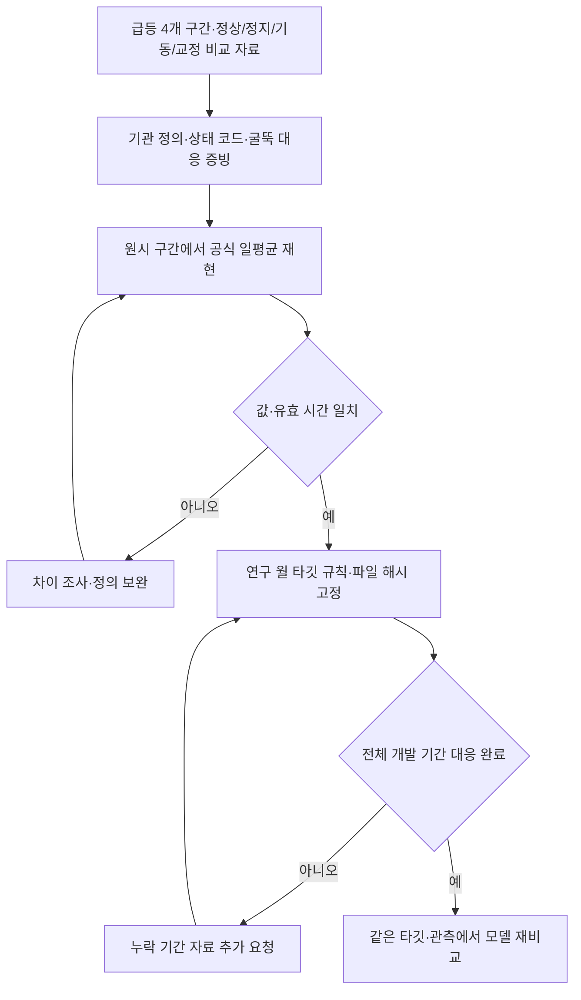

# 기관 확인→일평균 재현→타깃 규칙 확정→모델 재비교

## 지금 상태

대표 급등 자료와 기관 요청 초안, 입력 템플릿, 검증 코드 및 테스트를 만들었습니다. **기관 확인 자료는 아직 받지 않았고, 공식 일평균 재현과 실제 타깃 수정·확인 후 재학습도 완료하지 않았습니다.** 코드의 합성 자료 테스트와 실제 기관 자료 검증을 구분합니다.

현재 타깃 버전 기록 (로컬 `NOx_corrected/reports/target_validation_20261003/request_bundle/target_version.json`)은 `pending_provider_confirmation`, `training_allowed: false`입니다. `verified_v1/target_version.json`이 없는 것은 확인된 버전을 아직 생성하지 않았기 때문입니다. 그 파일이 필요한 학습 명령은 현재 바로 실행할 명령이 아닙니다.



## 1. 기관에 확인할 사항

| 요청 | 필요한 근거 | 확정 기준 |
| --- | --- | --- |
| 농도 정의 | NOx 보정 전·후, 산소 보정 기준, 단위·건습 기준 | 기관 담당 확인 문서와 실제 컬럼 대응 |
| 유효 측정 | 정상·정지·기동·교정·통신 오류 상태 코드, 유효 초/분 | 원본 코드의 의미 및 제외 규칙 확인 |
| 일평균 | 산식, 산출 구간, 최소 유효 시간, 결측 처리 | 정상·급등·정지·기동·교정일 재현 |
| 호기 대응 | 굴뚝 A/B·측정 지점↔호기, 적용 기간 | 공식 대응표·변경 이력 |
| 공식 대조값 | 날짜별 공식 농도와 유효 시간 | 원시 재현값과 사전 정한 허용 오차 내 일치 |
| 설명 변수 | 연소·SCR·환원제·정비 기록 | 실제 유효 급등 확인 후 시각 대응 |

요청 초안과 첨부는 기존 로컬 `reports/target_validation_20261003/request_bundle`에 있습니다. 공개 코드에서 로컬 자료 연결 후 `prepare`로 다시 생성할 수도 있습니다. 메일을 발송하거나 기관 회신을 받았다는 의미는 아닙니다.

새 요청 묶음은 기존 로컬 자료를 연결하면 준비할 수 있습니다. 저장 결과를 덮어쓰지 않도록 새 폴더를 지정합니다.

```bash
# NOx_corrected 안에서
python -m nox.target_validation prepare \
  --raw-dir data/readiness_bundle_20261002 \
  --output "reports/new_target_request_$(date +%Y%m%d_%H%M%S)"
```

## 2. 원시 구간을 이용한 공식 일평균 재현

코드는 공급기관이 이미 정의한 구간 농도를 사용하며, **유효 초 가중 일평균** 방식만 지원합니다. 보정 전 농도를 임의로 산소 보정하거나 일평균에서 원시 구간을 역산하지 않습니다. 기관 산식이 다르면 그 산식을 별도로 구현한 뒤 재검증해야 합니다.

필수 규칙 파일은 공급기관·확인 시각·자료 적용 기간·시간대·문서 파일/해시·상태 코드표·굴뚝 대응·최소 유효 시간·농도 및 시간 허용 오차를 기록합니다. 허용 오차와 월 관측 충족 기준은 모델 오차를 줄이기 위해 선택하지 않습니다.

원시 구간은 날짜의 24시간 전체를 명시적으로 덮어야 합니다. 무효·누락도 행으로 표시하고, 겹침·미등록 코드·잘못된 시간대·날짜 경계 미분할을 차단합니다. 무효 구간은 유효 시간 0으로 처리하되 원시값을 보존합니다. 재현값은 공식 일평균·유효 시간과 일대일 대조합니다.

**아래는 기관 자료 수령·파일 작성 후의 조건부 명령입니다. 현재 파일은 없습니다.** 비공개 원천 자료는 Git에서 제외한 `data/provider_private/`에 보관합니다.

```bash
python -m nox.target_validation verify \
  --rule data/provider_private/aggregation_rule.json \
  --intervals data/provider_private/provider_intervals.csv \
  --reference data/provider_private/provider_daily_reference.csv \
  --output reports/verified_provider_v1
```

불일치하면 `replay_mismatch`로 기록하고 학습용 월 타깃을 확정하지 않습니다. 정상 통과 후 `verified_research` 월 타깃과 출처·해시를 생성합니다. 이는 기관 문서의 진위를 자동 인증하거나 법적 월 배출량을 인증하는 기능이 아닙니다.

## 3. 월 연구 타깃과 버전

일별 호기 타깃은 확인된 모든 대상 굴뚝의 유효 일평균이 있을 때 산술평균합니다. 월 타깃은 적격 날짜의 산술평균이며, 명시한 연구용 날짜 충족률을 만족하지 못하면 결측으로 남깁니다. 공식 월평균·월 질량 타깃과 계속 구분합니다.

타깃 규칙 ID, 원시 파일·공식 대조 파일·증빙 문서·생성 파일의 해시를 고정합니다. 부분 급등 사례만 확인했을 때는 전체 학습 타깃이 확인된 것으로 취급하지 않습니다. 데이터 중 일부는 v0, 일부는 확인된 버전으로 섞어 성능을 비교하지 않습니다.

## 4. 동일 타깃으로 모델 재비교

`validated_training.py`는 검증 상태·해시·규칙 ID·개발 기간 전체 대응을 검사합니다. 규칙에 따라 제외된 월은 결측으로 표현하고, 나머지 특징의 전월·이동평균도 새 타깃에서 다시 구성합니다. 검증되지 않은 기존 월을 그대로 섞지 않습니다.

기관 자료 확인이 끝난 뒤, VS Code에서 아래 조건부 명령을 실행할 수 있습니다. 새 출력 경로를 사용합니다.

```bash
# 먼저 verify 통과로 실제 target_version.json이 생성됐는지 확인
 test -f reports/verified_provider_v1/target_version.json && \
 MPLCONFIGDIR=/tmp/nox-mpl python -m nox.validated_training \
   --raw-dir data/readiness_bundle_20261002 \
   --target-version reports/verified_provider_v1 \
   --output "reports/new_verified_training_$(date +%Y%m%d_%H%M%S)" \
   --deadline-seconds 3600
```

이 명령의 최대 실행 예산은 1시간입니다. 4개 고정 모델 계열 × 3개 기간 × 5개 시드 = 60개 실험, 75개 모델 적합을 수행합니다. 검증 지표로 후보를 고정한 뒤 후속 점검을 진행하고, 결과는 개발 비교로 기록합니다. 서비스 모델이나 기존 원본 자료는 자동 교체하지 않습니다.

유효 급등이면 연소·SCR 특징 보강을 진행합니다. 무효·집계 문제이면 기관 근거와 변경 사유를 남겨 타깃을 수정합니다. 어느 경우든 이후 확보하는 새 미사용 기간에서 성능을 확인해야 합니다.
